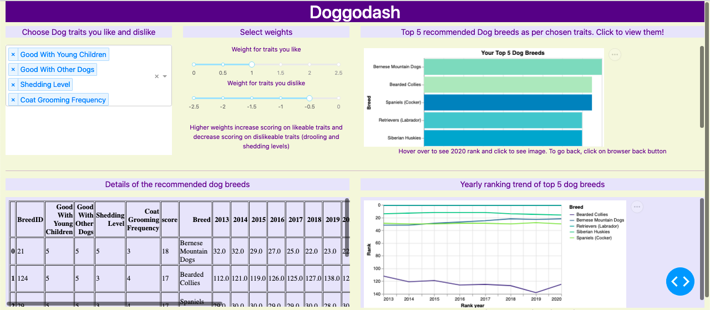
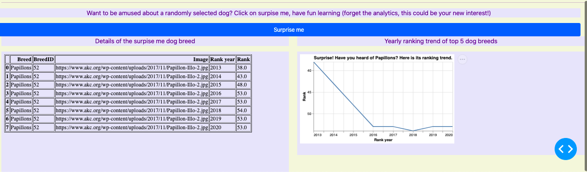

# DoggoDash
Check it out [here](https://doggodash.onrender.com).


Welcome to DoggoDash! DoggoDash is an interactive web app created using Dash and Python which provides visualizations for users to explore the breeds of dog that best match their selected preferences. Whether you are a potential new dog owner or are curious about your current dog breed's ranking among others, DoggoDash can help you! 

Here is a preview of DoggoDash:





## Usage

Users can choose the dog traits of interest from the dropdown menu (i.e. Affectionate With Family, Coat Type, Adaptability Level, Trainability Level). Thereafter, the user can decide the importance of each selected trait according to their preference using the slider provided (1 slider for importance of positive traits, 1 for importance of negative traits). As a result of the preferences, our algorithm will return a list of top five dog breeds that fit your preferences the most (in descending order) and display it on the landing page of the app. There will also be a plot showing the yearly ranking trends of the 5 selected dog breeds as well as a table with the details of each individual trait selected. From there, users can explore the recommended breeds and determine which one is the best for them! The dashboard also has a "surprise me" feature at the end to randomly display details and ranking trends of a dog breed upon clicking the surprise me button to invoke more curiosity and a bit of fun!

## Contributing

Interested in contributing? Check out the [contributing guidelines](https://github.com/UBC-MDS/doggodash/blob/main/CONTRIBUTING.md). Please note that this project is released with a Code of Conduct. By contributing to this project, you agree to abide by its terms.

DoggoDash is built using [Dash](https://dash.plotly.com/), and thus Dash is required for contributing to the project. Dash can be installed by running:
```
pip install dash
```
Once Dash is installed and the repository is cloned (following the instructions in the contributing guidelines), a local version of the app for testing can be built by running:
```
python src/app.py
```
Simply copy and paste the web address created into your browser of choice to begin seeing your changes come to life!

## Local installation

DoggoDash can be run locally using [Docker](https://www.docker.com/). First, clone the doggodash repository to your local machine and make sure the Docker desktop application is open. Then, run the following commands:
```bash
cd doggodash
docker-compose up
```
The local Docker build can then be accessed by navigating to http://localhost:8000/ in a web browser.

## License

`doggodash` was created by Samuel Quist, Steven Leung, Shiv Jena and Linh Giang Nguyen. It is licensed under the terms of the MIT license.

## Credits

`doggodash` was created with [`cookiecutter`](https://cookiecutter.readthedocs.io/en/latest/) and the `py-pkgs-cookiecutter` [template](https://github.com/py-pkgs/py-pkgs-cookiecutter).
